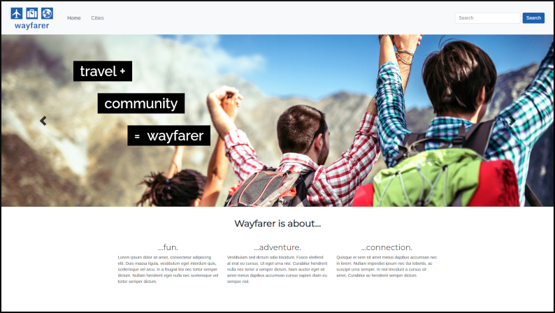
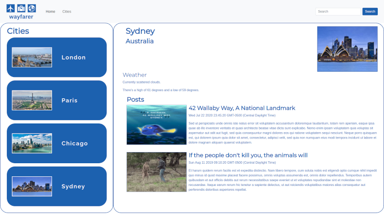
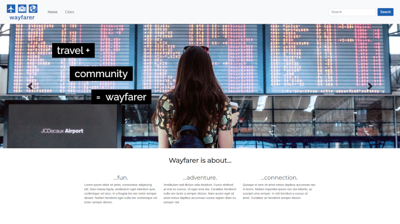
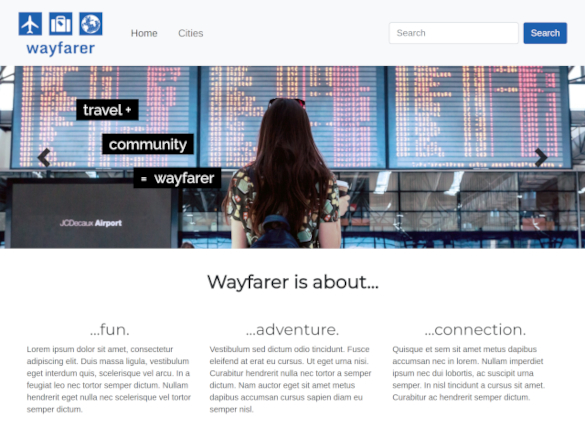
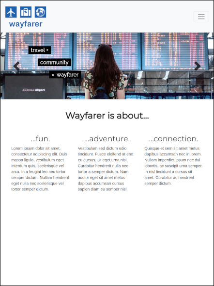
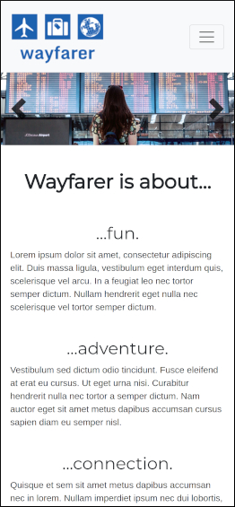
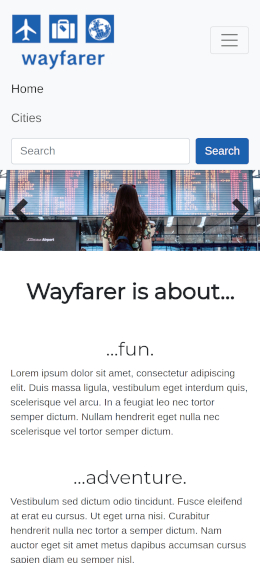

# Wayfarer Travel Community Angular App

A demo travel community website built in Angular 11.

## Usage
 * Clone and download this repository
 * Run `ng serve` in the terminal
 * Navigate to `http://localhost:4200/` in the browser

## Screenshots

### Responsive Design

